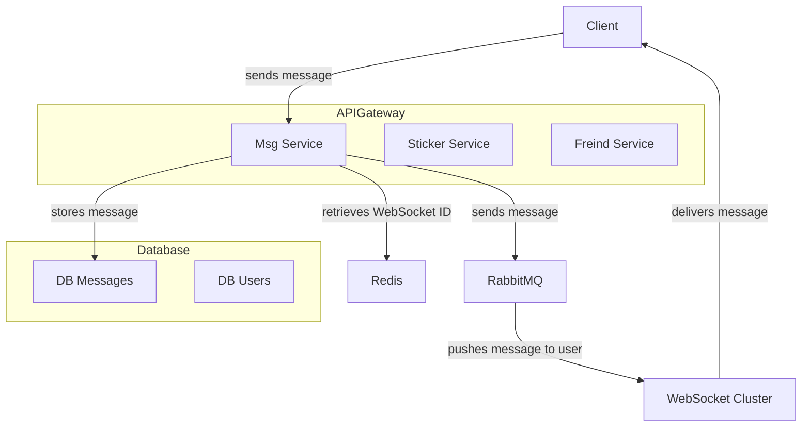
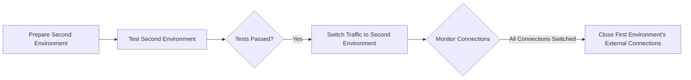
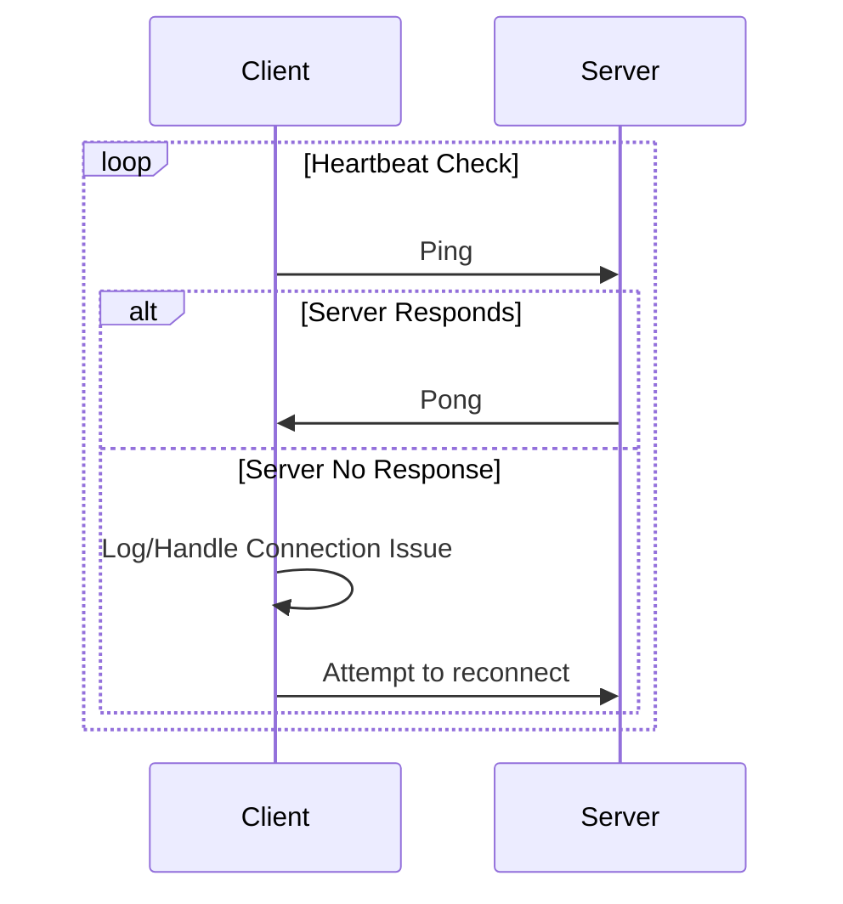
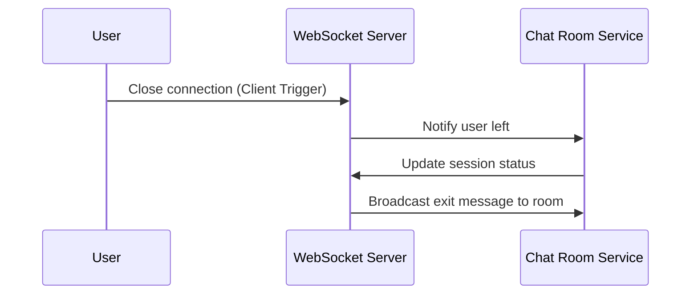
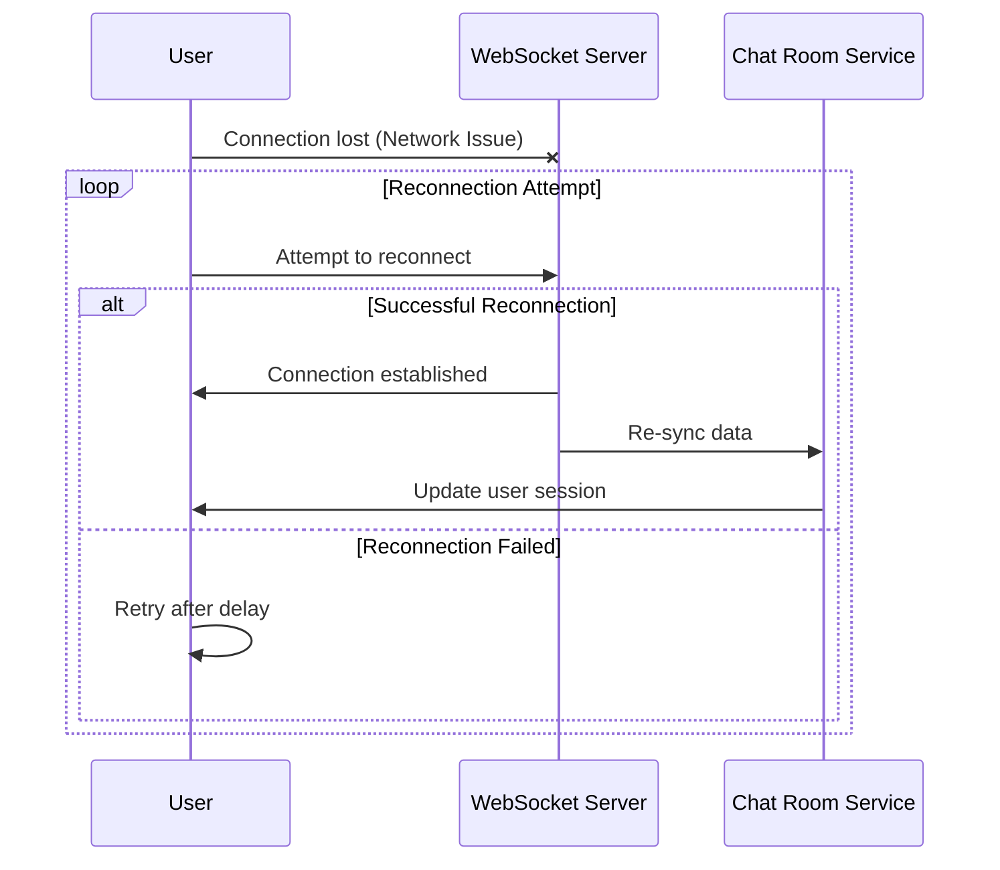

即時通訊(Instant messaging) 系統設計.

<!-- more -->

# Introduction

根據維基百科的解釋，即時通訊（IM）技術是一種在互聯網或其他電腦網絡上允許立即傳輸消息的在線聊天類型。消息通常在兩個或多個用戶之間傳輸，當每個用戶輸入文本並觸發傳輸給所有在共同網絡上連接的接收者時。它與電子郵件不同，因為即時通訊中的對話是即時的（因此稱為“即時”）。大多數現代即時通訊應用程序（有時被稱為“社交通訊應用程序”，“消息應用程序”，“聊天應用程序”或“聊天客戶端”）使用推送技術，並添加其他功能，如表情符號（或圖形笑臉），文件傳輸，聊天機器人，語音IP或視頻聊天功能。

# Design
## 技術指標

一個IM系統架構應該符合以下幾個技術指標：

1. **高可用性**：IM系統的任何組件掛掉不應該影響整體服務，或者可以接受一定程度的服務降級（核心服務除外）。
2. **可擴展性**：隨著用戶數量的增加，系統應該能夠透過水平擴展增加吞吐量。
3. **序列性**：訊息必須按照順序呈現。
4. **即時性**：可以容許數秒的延遲，但不能接受分鐘級以上的延遲。
5. **可靠性、一致性**：避免訊息丟失。
6. **歷史訊息**：相關訊息可以保存，讓用戶重新開始通訊時可以獲取以往的資料。
7. **可訂製性**：IM系統與Client的連接是長連接，任何功能訂製上版都可能使既有的原本的Connect斷掉，需要有方法避免佈署Connect的部分；或者上版時最低程度影響用戶。

## 系統架構

- **API Gateway（APIGateway）**：API Gateway 是一個入口服務，負責接收來自客戶端的請求並將其路由到相應的後端服務。在這個架構中，API Gateway 可能負責將客戶端發送的消息請求路由到消息服務（msg_service）。

- **消息服務（msg_service）**：消息服務是一個後端服務，負責處理來自客戶端的消息。當 API Gateway 將消息請求路由到消息服務時，消息服務將處理該消息，可能包括將消息存儲到數據庫中、檢索相關用戶的 WebSocket ID、將消息推送到消息隊列等操作。

其他組件的用途如下：
- **數據庫**：用於存儲用戶之間發送的消息。當消息服務收到消息時，可能會將其存儲到消息數據庫中，以便後續檢索和管理。
- **Redis**：Redis 用於快速地檢索 WebSocket ID。當消息服務需要將消息推送給特定用戶時，可能會通過 Redis 快速地檢索到該用戶的 WebSocket ID。
- **RabbitMQ（mq）**：RabbitMQ 是一個消息隊列服務，用於處理異步消息通信。當消息服務需要將消息推送給用戶時，可能會將消息發送到 RabbitMQ，由 RabbitMQ 負責將消息推送給相應的 WebSocket 集群。
- **WebSocket 集群（WebSocket Cluster）**：WebSocket 集群負責管理與客戶端的 WebSocket 連接。當有新消息到達時，WebSocket 集群將負責將該消息推送給相應的客戶端，從而實現即時通訊。

我們將所有服務做拆分，針對業務情境劃分不同的api service，對於大多數的服務更新並不會直接影響到WebSocket集群，避免長連接斷連；同時個別服務可以進行個別的擴展，或者資源不足時可以個別做服務降級，僅保留核心服務繼續運行。

對於擴展性，包含WebSocket在內的所有集群都可以做水平擴展，而不影響既有連線。

如果非得對WebSocket服務進行更新，可以透過藍綠佈署的方式，待所有新版本佈署完畢後透過推播通知重新獲取新的連線。

## 斷線處理
針對WebSocket連線處理，因為連線可能因為用戶主動離開、網路異常、後端服務異常...等等原因導致用戶端收不到回應，所以針對這幾個情況可以另外處理；而WebSocket本身可能因為長時間沒有信息往來導致被網路設備或其中的中間件(load balance, firewall ..etc)導致被斷開，所以需要定時有信息往來，這邊可以透過發送ping/pong來做heart beat檢測

針對用戶主動離開聊天室的作法可以由Client發送關閉訊息，然後透過其中中間件通知做後續處理（譬如廣播用戶離開訊息）

針對網路異常或後端服務異常（包括heart beat failed)，可以透過延遲retry的方式獲得新的連線。
