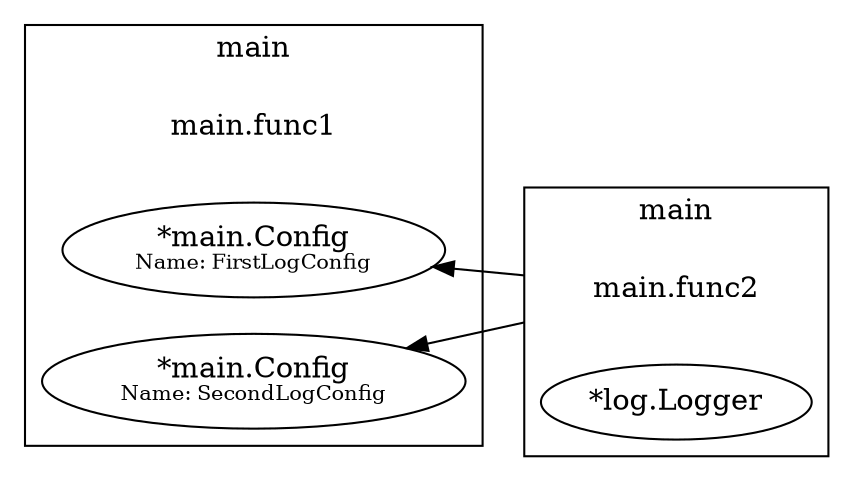

因為公司用dig來做DI管理，所以花一點時間來看一下dig大致上怎麼用。之前曾經花一點時間去看wire怎麼用，老實說code generate的選項我還是比較排斥，剛好這邊用dig也是不錯。

<!-- more -->


## Install

> go get 'go.uber.org/dig@v1


## Examples

dig使用起來很簡單，通過官網的範例可以很容易看出如何使用：

```go
func main() {
	type Config struct {
		Prefix string
	}

	c := dig.New()

	// Provide a Config object. This can fail to decode.
	err := c.Provide(func() (*Config, error) {
		// In a real program, the configuration will probably be read from a
		// file.
		var cfg Config
		err := json.Unmarshal([]byte(`{"prefix": "[foo] "}`), &cfg)
		return &cfg, err
	})
	if err != nil {
		panic(err)
	}

	// Provide a way to build the logger based on the configuration.
	err = c.Provide(func(cfg *Config) *log.Logger {
		return log.New(os.Stdout, cfg.Prefix, 0)
	})
	if err != nil {
		panic(err)
	}

	// Invoke a function that requires the logger, which in turn builds the
	// Config first.
	err = c.Invoke(func(l *log.Logger) {
		l.Print("You've been invoked")
	})
	if err != nil {
		panic(err)
	}
}
```

它透過`dig.New()`去產出IOC容器，使用`*dig.container.Provide()`將需要注入的物件注入，接著通過`*dig.container.Invoke()`取出。

面對同時需要注入相同結構但賦值不同的struct也可以通過`name filed`來操作，一樣拿官網這個例子來看，假設我有不同`prefix`的`config`需要注入（在實務上這可以是不同的db connection, redis connection, ...etc）。

```go
func main() {
	type Config struct {
		Prefix string
	}
	c := dig.New()

	err := c.Provide(func() (*Config, error) {
		var cfg Config
		err := json.Unmarshal([]byte(`{"prefix": "[foo][FirstConfig]"}`), &cfg)
		return &cfg, err
	}, dig.Name("firstConfig"))
	if err != nil {
		panic(err)
	}

	err = c.Provide(func() (*Config, error) {
		var cfg Config
		err := json.Unmarshal([]byte(`{"prefix": "[foo][SecondConfig]"}`), &cfg)
		return &cfg, err
	}, dig.Name("secondConfig"))

	if err != nil {
		panic(err)
	}

	type LogConfigs struct {
		dig.In
		FirstConfig  *Config `name:"firstConfig"`
		SecondConfig *Config `name:"secondConfig"`
	}

	err = c.Provide(func(cfg LogConfigs) *log.Logger {
		return log.New(os.Stdout, cfg.FirstConfig.Prefix, 0)
	})
	if err != nil {
		panic(err)
	}

	err = c.Invoke(func(l *log.Logger) {
		l.Print("You've been invoked")
	})
	if err != nil {
		panic(err)
	}
}
```

其中的在`LogConfigs`中的`dig.In`是為了告訴dig框架通過這個入口點進行依賴注入，當使用了這個物件後這個struct的所有欄位都會變成依賴注入的依賴項，而不是struct本身，這樣做可以避免手動創建大量的依賴項。

同時它提供了三個filed讓你使用，分別是
1. name
2. optional
3. group

`name field`的用法上面已經有表示了，就是讓你去找到對應的實體；而`optional`是標記這個東西是不是必要的，當標籤為`true`則他從IOC容器中找不到對應物件時會直接給一個nil.

```go
type LogConfigs struct {
    dig.In
    Cfg *Config `optional:"true"`
}
```

上面的例子是注入了兩個不同的config，但有些狀況會是我要注入一個struct但裡面會有複數個相同結構的物件，譬如說

```go
type LogConfigRev struct {
	FirstConfig *Config
	SecondConfig *Config
}
```

這時候可以用`dig.Out`來操作，這個方法是宣告被放入`dig.Out`的結構體他屬於`dig`依賴注入的輸出。聽起來很模糊，我那時候看也是很模糊；直接給例子如下：

```go
	type Config struct {
		Prefix string
	}

	type ConfigRev struct {
		dig.Out
		FirstLogConfig  *Config `name:"FirstLogConfig"`
		SecondLogConfig *Config `name:"SecondLogConfig"`
	}

	type ConfigInfos struct {
		dig.In
		FirstLogConfig  *Config `name:"FirstLogConfig"`
		SecondLogConfig *Config `name:"SecondLogConfig"`
	}

	c := dig.New()
	err := c.Provide(func() (ConfigRev, error) {
		var firstCfg Config
		var secCfg Config
		err := json.Unmarshal([]byte(`{"prefix": "[foo][FirstConfig]"}`), &firstCfg)
		if err != nil {
			panic(err)
		}
		err = json.Unmarshal([]byte(`{"prefix": "[foo][SecondConfig]"}`), &secCfg)
		if err != nil {
			panic(err)
		}

		return ConfigRev{FirstLogConfig: &firstCfg, SecondLogConfig: &secCfg}, err

	})

	if err != nil {
		panic(err)
	}

	err = c.Provide(func(cfg ConfigInfos) *log.Logger {
		return log.New(os.Stdout, cfg.FirstLogConfig.Prefix, 0)
	})

	if err != nil {
		panic(err)
	}

	err = c.Invoke(func(cfg ConfigInfos, l *log.Logger) {
		l.Println("You've been invoked.")
	})

	if err != nil {
		panic(err)
	}
```

有點像我把一個整體透過`dig.Out`打散出去，而且給他`name`讓我可以在其他地方透過這個名稱拿到我要的物件。


整體而言`uber/dig`是很好上手的DI工具，內部透過反射去做；在效能上肯定會比`go/wire`來得慢，畢竟後者透過抽象語法樹直接用code generate把相關的code給補上去。

但勝在好上手，簡單使用；還提供了一些額外的功能。

譬如說他可以生成dot格式的依賴圖，只需要你在下面加個：

```go
b := &bytes.Buffer{}
if err = dig.Visualize(c, b); err != nil {
	panic(err)
}
fmt.Println(b.String())
```

其中`c`為`*dig.Container`，他就會打印出dot格式的依賴圖，例如：



因為blog支援mermiad...我懶得弄圖片了，就自己找線上轉換器把它轉成圖吧XD...

另外還有個缺點是相較於`go/wire`依賴關係不對時直接gen code就失敗了，而`uber/dig`編譯是不會出錯的，畢竟透過reflect去做所以也正常，團隊一大這件事情可能需要注意一下。