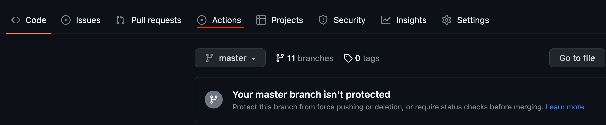
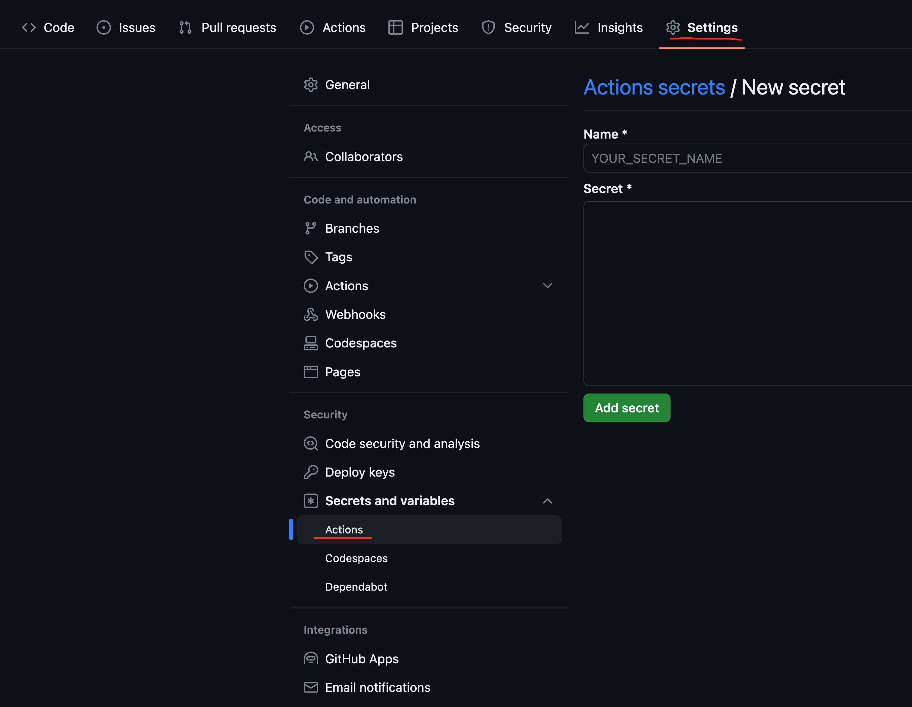

偶爾會回雲林WFH，手邊只會帶著公司的筆電，有新文章要想PO就覺得好懶；要搞Node、Hexo、AWS，想著老是拖著自動化沒幹乾脆這次一起弄一弄好了。

<!-- more -->

github action是很方便的CI/CD工具，對於public的專案有提供一定的額度讓你免費使用。
> 2023/04/17 每個月可以使用2000 minutes.

他同時提供了一個runner讓你免去了佈署機器的功，當然對於比較複雜的CI或者有一些依賴性的狀況下github action也提供`self-hosted runners`讓你可以在自己的主機上設定runner.同時可以省下一些費用。

因為blog的建置跟佈署蠻簡單的，就是通過hexo cli去generate static web code然後將他無腦的送到AWS S3，後續CloudFront更新cache就可以將新內容佈署到網站上了。

先到專案上面，選擇`Action`


創建一個deploy yaml，我的內容如下：
``` yaml
name: blog deploy

on:
  push:
    branches: [ "master" ]

jobs:
  build:
    runs-on: ubuntu-latest

    strategy:
      matrix:
        node-version: [18.x]

    steps:
    - uses: actions/checkout@v3

    - name: Use Node.js ${{ matrix.node-version }}
      uses: actions/setup-node@v3
      with:
        node-version: ${{ matrix.node-version }}
        
    - name: Install hexo
      run: npm install -g hexo-cli@4.3.0

    - name: Hexo generate
      run: npm install && hexo generate

    - name: sync public folder to aws s3
      uses: jakejarvis/s3-sync-action@v0.5.1
      with:
        args: --acl public-read --follow-symlinks --delete
        AWS_REGION: "ap-northeast-1"
        SOURCE_DIR: "public"
        DEST_DIR: ${{ secrets.AWS_S3_BLOG }}
      env:
        AWS_ACCESS_KEY_ID: ${{ secrets.AWS_ACCESS_KEY_ID }}
        AWS_SECRET_ACCESS_KEY: ${{ secrets.AWS_SECRET_ACCESS_KEY }
```

內容大致是在ubuntu上使用node 18.x 版本為環境，下載hexo cli然後生成static web code，最後上傳到AWS S3。

其中AWS_ACCESS_KEY之類的訊息可以儲存在Secret裡面，避免敏感資訊外洩，這些東西在CI執行過程中也不會被顯示出來。

但AWS權限上還是建議控管一下，這個就專門給S3用，其他權限鎖一鎖還是比較保險一點。

Secret的設定位置在


設定好之後就可以試著跑跑看了。