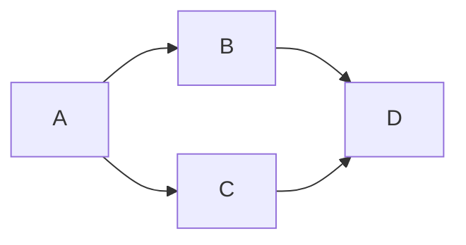
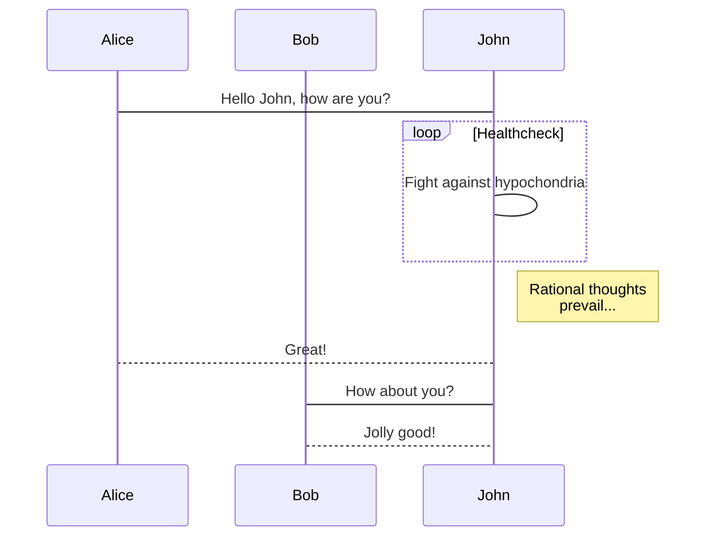

最近因為要梳理專案架構，每天都在畫甚麼流程圖、狀態圖、User case... etc
頓時不知道自己是工程師還是畫圖星人，而我目前的主力編輯工具是Markdown，如果Markdown可以加上畫圖工具讓我一次處理完就太好了，於是我找上了Mermaid。

<!-- more -->

# 介紹


## 介紹前的Murmur
以前我在畫圖的時候最常用的是 Draw.io，一段時間後發現 Draw.io 要做版控實在蠻不方便的，而且在那邊拖拉方塊真的很煩人；啊我就工程師，我圖片只要能整齊乾淨就好了，可是我是美術苦手啊我連畫整齊都辦不到，高中時期我美術還差點被當掉。

基於以上種種原因我改用了PlantUML，這是一個可以用文字去畫圖的工具，可以輕易地上版控，而且自動排版真的是懶人福音，比較大的缺點就是他是基於`java`的專案，所以還得額外去安裝一些有的沒的。

再來就是他沒辦法直接寫在Markdown上面，寫份文件還要生成圖片之後透過Markdown語法貼進來，對一個懶鬼工程師來說就是多一道功夫，挺阿雜的。

然後我現在這個Blog based on Hexo，也是支援markdown撰寫文章的，所以如果能一次搞定就太好了。

於是到了現在，我採用Mermaid；文末順便介紹一下怎麼在Hexo添加Mermaid。

## Mermaid


Mermaid是baseed on javascript的一款畫圖工具，當然他也是open source的，目前的更新看起來算是穩定，也有不少新的圖在慢慢釋出。

目前(2021/06/15)，他擁有以下圖表的支援 :
* Flowchart
* Sequence diagram
* Class Diagram
* State Diagram
* Entity Relationship Diagram
* User Journey
* Gantt
* Pie Chart
* Requirement Diagram

還有一些實驗性的圖，像是git flow diagram。

基本涵蓋了一個工程師常會畫到的圖表，功能算是很足夠了。當然還有一些架構圖、系統圖類型的，可能會有其他工具更適合(例如lucid，這個畫架構圖蠻漂亮的)。

附上 [Mermaid Docuemnt](https://mermaid-js.github.io/mermaid/#/README?id=diagram-types)

# Markdown with mermaid
說Mermaid可以畫在Markdown上其實不太精準，主要還是要看使用的平台在解析Markdown的時候有沒有支援Mermaid。對於我個人來說，我常用的GitLab(v 10.3)、Confluence，都是支援Mermaid的(Confluence要安裝APP)。

對於自製的Website，因為Mermaid基於Javascript，所以稍加設定也是可以支援的，所以Github的Md其實也可以魔改一下去做顯示。

至於平常開發寫md的時候我是搭配Visual studio code，安裝套件`Markdown Preview Mermaid Support`，實際怎麼用我們稍微做示範。

在Markdown上面寫mermaid是很容易的，就像我們平常寫code block一樣的做法就可以。

> \`\`\` mermaid 
> flowchart LR;
>   A-->B;
>   A-->C;
>   B-->D;
>   C-->D;
> \`\`\`


實際顯示


Mermaid的語法相當的簡單，首先就是定義要甚麼圖，然後他要走麼走；像這張圖我就是做flowchart，然後從左至右，接著就是各節點該怎麼走。

其他圖的畫法基本上沒差太多，譬如時序圖

> \`\`\` mermaid 
> sequenceDiagram
> 　　　participant Alice
> 　　　participant Bob
> 　　　Alice->John:Hello John, how are you?
> 　　　loop Healthcheck
> 　　　　　John->John:Fight againsthypochondria
> 　　　end
> 　　　Note right of John:Rational thoughts<br/ > >prevail...
> 　　　John-->Alice:Great!
> 　　　John->Bob: How about you?
> 　　　Bob-->John: Jolly good!
> \`\`\` 



都是差不多意思，所以上手的成本並不會很高，剩下的幾種圖形可以直接到[Mermaid Docuemnt](https://mermaid-js.github.io/mermaid/#/README?id=diagram-types)去看。

# Hexo 也支援Mermaid !

我個人的blog是使用Hexo去架設，主題用Icaurs。Hexo也是支援Mermaid的Plugin，只要稍加設定就可以在blog上直接顯示繪製好的圖，真的是很方便。

設置的方法因為我不是很熟悉Javascript，所以就是到處爬文得到的結果，流水帳似的分享給大家。

首先先安裝plugin
> npm install hexo-filter-mermaid-diagrams

然後在 `_config.yml` 添加下面這段
```yml
mermaid: ## mermaid url https://github.com/knsv/mermaid
  enable: true  # default true
  version: "7.1.2" # default v7.1.2
```

然後在各主題相對應Layout添加引用的代碼就可以了。

以icarus為例，我是在`themes\icarus\layout\comment\script.jsx`修改

```js
        return <Fragment>
            <script src={cdn('jquery', '3.3.1', 'dist/jquery.min.js')}></script>
            <script src={cdn('moment', '2.22.2', 'min/moment-with-locales.min.js')}></script>
            <script dangerouslySetInnerHTML={{ __html: `moment.locale("${language}");` }}></script>
            <script dangerouslySetInnerHTML={{ __html: embeddedConfig }}></script>
            {clipboard ? <script src={cdn('clipboard', '2.0.4', 'dist/clipboard.min.js')} defer={true}></script> : null}
            <Plugins site={site} config={config} page={page} helper={helper} head={false} />
            <script src={url_for('/js/main.js')} defer={true}></script>
            <script src="https://unpkg.com/mermaid@8.8.4/dist/mermaid.min.js"></script>
        </Fragment>;
```


